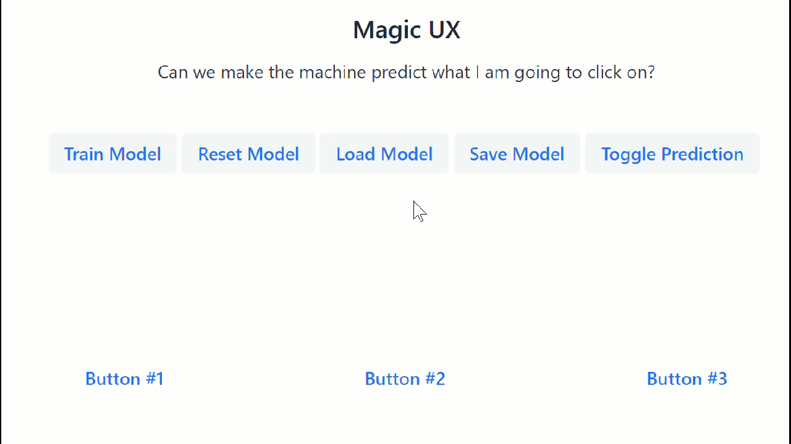
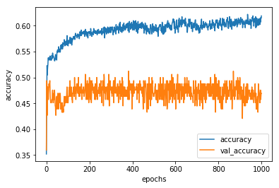
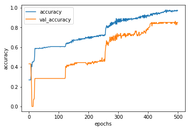
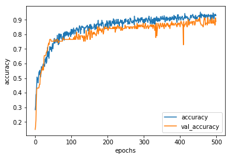

# ux-by-tfjs

Project: https://github.com/DJCordhose/ux-by-tfjs

Notebook for Server side processing: https://colab.research.google.com/github/DJCordhose/ux-by-tfjs/blob/master/notebooks/rnn-model.ipynb

## What does it do?

After training on your personal mouse paths it can predict what button you are likely to click on. You can then highlight that button for easier access or do anything else that might seem reasonable.

## How does this work?

TODO

## What makes this hard?

This is specific to how my input device works (this does not work for touch)
- using trackpad
- windows / mac / linux
- using mouse
- speed of input device

And personal style
- beginner / expert
- fast / slow
- direct / curvy

## History

### Experiment 1

* uses fixed padding (final 15 events before hitting button are dropped)
* four input values: posX, posY, deltaX, deltaY
* uses special zone: meaning no button navigated
* buttons in a single line and close to each other
* training data by always going from neutral zone to button in a straight line

### Experiment 2

_Hypothesis: more context works better and movements far away could still indicate button_

* split path to aim into fragments
  * better prediction: each good for prediction in different parts of the path
  * more training data
* records raw events to give more flexibility
* adds deltaT to input values
* buttons moved closer together
* training data much more random
* training works by splitting into 4 segments each used for prediction of button
* clearly overfits, but task is hard
* does not well in practice

### Experiment 3

_Hypothesis: only close movements can be used for prediction_

* clipped to two close segments
* introduced zeroed out zone for demo purposes (posY < 225)
* better demo:
  * buttons closer together
  * prediction much earlier
* Download known good model from remote

### Experiment 4

* added tfjs-vis
* added across-the-board regularization
* changed layout
* different RNN types
  * LSTM/GRU: similar style, but LSTM seems to be a bit better in real world
  * simpleRNN: generalizes great to proximity, even though zero examples in training data
* pre-trained server model converted to tf.js: seems to be somewhat broken (all predictions are button 3)

### Experiment 5

* different RNN types
  * LSTM/GRU: similar style, but LSTM seems to be a bit better in real world
  * simpleRNN: generalizes great to proximity, even though zero examples in training data

## Possible improvements

* create baselines to understand if this is really good
  * proximity based
  * interpolation of path using linear regression (or just dx/dy for a single point)
